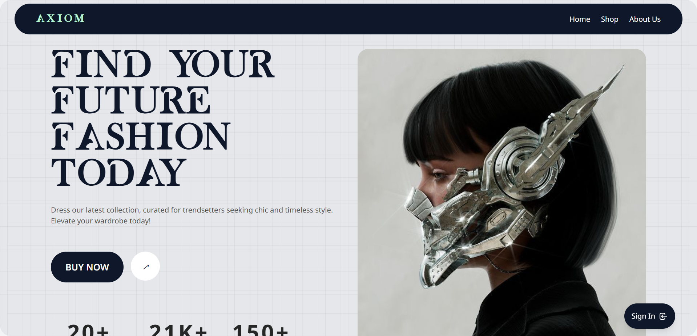
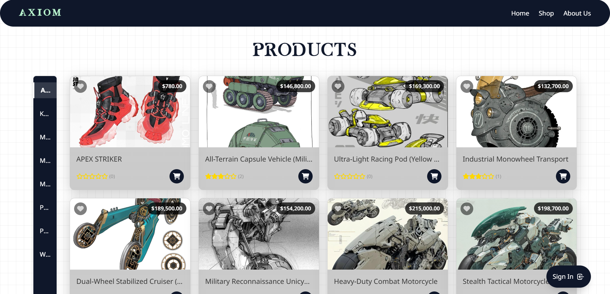

# Axiom Shop - Future Fashion E-commerce Platform

**🌐 Live Demo:** [Visit Axiom Shop](https://axiom-shop.infinityfreeapp.com) (Deployed on InfinityFreeApp)

## Overview

Axiom Shop is a cutting-edge e-commerce platform focused on futuristic fashion retail. Built with modern web technologies, this project demonstrates advanced PHP development, responsive design, and a comprehensive understanding of full-stack e-commerce implementation.



## Features

### 🛍️ Customer Experience

- **Immersive Product Browsing** - Modern grid layout with hover effects and detailed product views
- **Seamless Checkout Process** - Multi-step checkout with address management and order summary
- **User Accounts** - Comprehensive profile management with order history and preferences
- **Wishlist System** - Save and manage favorite products
- **Rating & Reviews** - Product feedback system with star ratings



### 👨‍💼 Administration

- **Supervisor Dashboard** - Data visualization with sales analytics and customer metrics
- **Customer Management** - Detailed customer information and activity tracking
- **Inventory Control** - Product management system with categories and variants
- **Order Processing** - Complete order management workflow
- **Customer Reports** - Handle and respond to customer feedback
  
### 💻 Technical Implementation

- **Responsive Design** - Fully mobile-optimized using Tailwind CSS
- **Modern UI** - Glass morphism effects, grid backgrounds, and smooth animations
- **Security Features** - Secure authentication and data protection
- **API Architecture** - Well-structured backend with clear separation of concerns
- **Database Integration** - Efficient SQL queries and data management

## Technologies Used

- **Frontend**: HTML5, CSS3, JavaScript, Tailwind CSS
- **Backend**: PHP, MySQL
- **Libraries**: Font Awesome, Chart.js
- **Tools**: Composer, npm

## Project Structure

Axiom_Shop/
├── admin/           # Administrator interfaces
├── api/             # Backend API endpoints
├── assets/          # Static assets (images, fonts)
├── auth/            # Authentication system
├── config/          # Configuration files
├── css/             # Stylesheets
├── includes/        # Reusable PHP components
├── js/              # JavaScript files
├── shop-api/        # Shop-specific API endpoints
├── uploads/         # User-uploaded content
└── user/            # User account management

## Key Implementations

### Responsive Glass Card UI


```css
.glass-card {
    background: rgba(0, 0, 0, 0.2);
    backdrop-filter: blur(8px);
    -webkit-backdrop-filter: blur(8px);
    border: 1px solid rgba(255, 255, 255, 0.3);
    box-shadow: 0 8px 32px rgba(0, 0, 0, 0.5);
}

```

## Future Enhancements

- Frontend enhancement
- Payment gateway integration
- Progressive Web App (PWA) functionality
- Advanced recommendation engine
- Multi-language support
- Dark light theme toggle

Contact
Feel free to reach out for internship opportunities!

Email: fchafii05@gmail.com
LinkedIn: ferdaouss chafii
